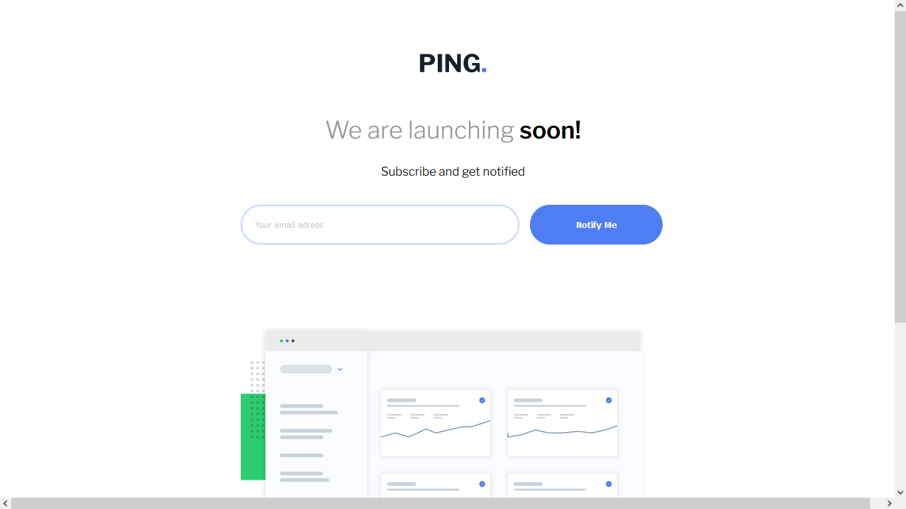
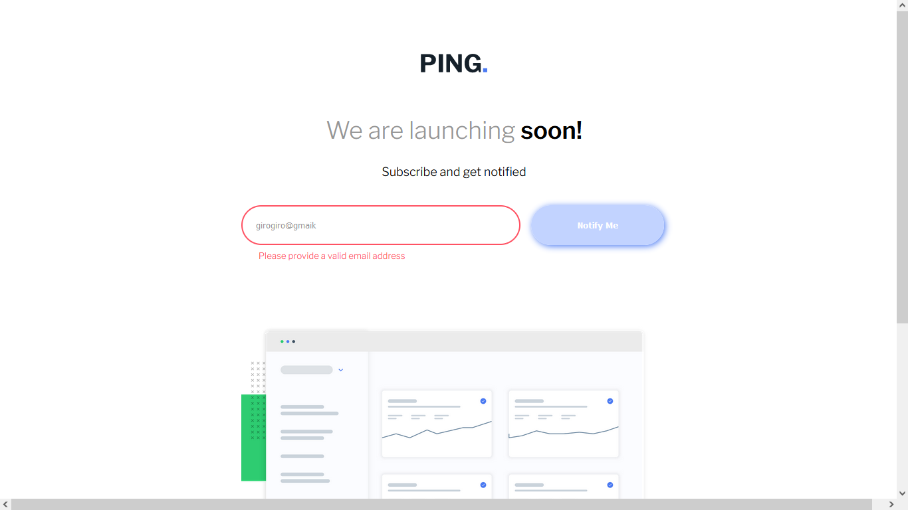
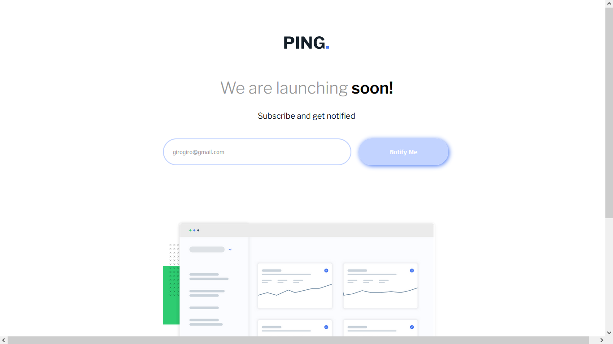
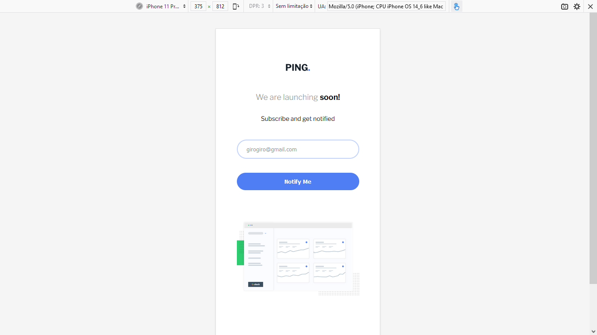
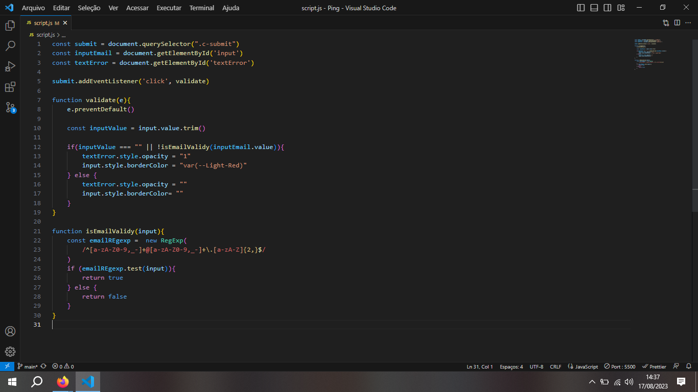

<h1>Ping Challange Frontend Mentor</h1>
 

Realizado com HTML, CSS e JS Vanilla.

 
<h2>Layout Desktop</h2>
 

 
<h2>Layout Desktop com email vazio </h2>
 

 
<h2>Layout Desktop com erro no email</h2>
 

 
<h2>Layout Desktop com email correto.</h2>
 

 
<h2>Layout Mobile</h2>
 

 
<h2>Layout Mobile com erro no email</h2>
 

 
<h2>Código JS que utilizei para validar email</h2>
 

 
<h3>Sobre o desafio</h3>
 

Desafio sem nenhuma novidade. Fiquei contente pois utilizei um repositorio de um putro desafio que eu tinha realizado, então não precisei ver videos no Youtube, consegui ler meu próprio código, e consegui adaptar para este novo desafio.
